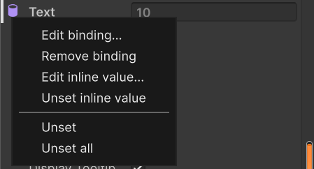

### UIToolkit
- 最终效果：
- 工作流：借鉴Web开发工作流
    - UXML：内容和布局，设计各个不同UI控件的包含关系
    - USS：样式设计，作为可复用的外联样式（相对于内联样式）
    - C#脚本：功能行为
    - UIDocument组件：GameObject通过组件关联对应的UI文件
- 优点：
    - 标准化UI开发工作流
    - Flexbox系统，轻松实现UI自动适配
    - USS样式表，让UI样式的修改更为便捷
    - 高性能：远远高于UGUI
- UQuery：查找元素处理，类似项目的GetUIObject根据控件名获取控件对象
    - Query：查找多个元素
    - Q：查找首个元素，等价于Query.First()的处理
    - Query.AtIndex(i)：从Query获取的多个元素中查找索引为i下的元素
- 模板容器：可复用的UI资产
    - 创建流程：选中UXML中UI元素右键创建模板，保存为UXML文件（子UI的概念）
    - 应用场景：将UI中可复用的元素抽出来作为模板来使用，类似目前UI组件化框架中将默认不加载控件升级为预制体的处理
- 自定义控件（Custom controls）：
    - 通过继承VisualElement + 编码模板
    - 应用场景：配合模板容器，在自定义控件的初始化函数中创建已有的模板容器
- Scriptable Object
    - 作用：可复用的数据资产，充当数据容器，可独立存储大量数据，可以理解为我们的导表、Model/VM，先声明数据结构，再创建数据实例（运行时对象或离线创建的assert文件）
    - 编辑器操作：继承ScriptableObject并应用特性[CreateAssetMenu]来支持在编辑器中通过右键菜单栏创建对应的数据实例并存储为.asset文件
    - 应用场景
        - 导表：先声明导表数据结构，通过创建.asset文件来填写导表数据，但每次只能填写一个数据实例对象（可以理解为1行数据），除非表结构设计成可管理全量导表数据
        - Model/VM：通过运行时创建数据实例对象来支撑业务逻辑，且比较方便支持序列化（运行时数据保存为.asset文件）
        - 数据绑定：除了编辑器中的可视化配置绑定数据外，还可以在运行时通过脚本来实现数据绑定处理（动态创建实例对象）
- Excel导入导出：
    - 背景：ScriptableObject编辑大量数据成本较高
    - 流程：创建Excel->编辑数据->保存为csv->C#脚本中在OnValidate（只在编辑器中生效，游戏运行时不生效，一般用于在编辑器中提供即时的反馈）->加载csv文件数据并解析->填充至序列化字段数据中（最终编辑器中呈现的是列表）
    - 思考：利用Excel二维表的编辑优势并搭建数据源自动(半自动)同步至编辑器的处理流程
- UI交互处理
    - Manipulator操纵器：细颗粒度的交互行为处理，代码复杂度会高一点，但能确保不同交互类型的职责单一
        - 激活过滤器：ManipulatorActivationFilter，可设置交互类型，例如鼠标左键点击还是右键点击（button）、点击次数（clickcount）、修饰键（modifiers）
    - Event事件系统：粗颗粒度的交互行为处理，代码更简单，但一般会将所有处理都放到同一个函数中（除非业务方主动去拆分优化）
- USS
    - 选择器：精确选中并定制我们UI当前的任何元素，选择器类型间有优先级划分（针对多个选择器同时生效同一个元素中某个属性）
        - 简单选择器：优先级从高到低排序
            - 名称选择器：以#开头，以UI元素名字进行匹配
            - 样式类选择器：以.开头，添加样式类的方式可以通过拖动样式类到UI元素上进行添加，可以针对内置的样式类选择器进行覆写（同名）
            - C# 类型选择器：例如Button、Label、VisiualElement等
            - 通用选择器：*，选择的是所有元素
        - 复合选择器
            - 后代选择器：
                - 语法：selector1 selector2 {...}
                - 匹配：某个UI元素底下符合规则的所有层级的子元素
            - 子选择器：
                - 语法：selector1 > selector2 {...}
                - 匹配：某个UI元素底下符合规则的下一个层级的子元素
            - 多重选择器
                - 语法：Selector1Selector2{...}
                - 匹配：符合所有规则的元素
        - 伪类
            - 语法：selector:state {...}
            - 匹配：处于特定状态的元素，其中状态可参考官网文档（https://docs.unity3d.com/cn/2020.2/Manual/UIE-USS-Selectors-Pseudo-Classes.html）
            - 应用场景：例如鼠标悬停后显示高亮边框
    - 切换主题实现：创建不同的CSS文件，根据选择器来获取UI元素并控制最终界面表现效果
- 数据绑定（Unity2023.2版本新支持）
    - UIBuilder中操作数据绑定
        - 操作流程：
        - 数据绑定后表现：
        - 数据源特性：子元素会继承父元素的数据来源（降低子元素数据绑定的配置成本）
        - 绑定模式：
            - TowWay：双向绑定，UI改变绑定数据源也同步改变，数据源改变UI也同步改变
            - ToSource：单向绑定，UI改变后绑定数据源也同步改变（音乐音效的音量条）
            - ToTarget：单向绑定，绑定数据源改变后UI也同步改变（最常用）
            - ToTargetOnce：绑定数据源改变后只会同步响应一次UI，后续改变都不会响应（例如：达到50级成就弹框，后续升级不会重复触发）
        - CreateProperty和DontCreateProperty特性
            - CreateProperty：对原始数据字段做后处理并支持UIBuilder中配置数据绑定
            - DontCreateProperty：针对通过CreateProperty特性处理的数据字段，不支持UIBuilder中配置数据绑定（主要是减少配置选项，降低用户配置错误的概率）
    - UXML中声明数据绑定
        - 操作流程：直接在IDE中打开UXML文件进行编辑
    - C#脚本中进行动态数据绑定
        - 操作流程：脚本组件中通过获取UI元素并调用SetBinding方法来设置数据绑定处理
- 问题和思考
    - 【问题】编写C#脚本时需要频繁切换UIBuilder复制粘贴控件名，每次Unity切换到前台就会走脚本reload的逻辑，会卡一会体验不是太好
        - 【方案】：Unity中取消自动刷新处理，改用手动刷新（快捷键）
    - 【问题】纯字符串层面的操作控件对象，开发过程中容易出错，也增加后续UI的维护成本
    - 【思考】UIToolkit中可以在UXML中使用相同命名的UI元素，在特定场景下能改善（精简）已有的业务代码写法（我们一般在代码中需要对控件名增加编号后缀代码中使用拼接字符串处理来操作具体控件）
        - 项目接入：由于项目要求同一个UI中各个元素命名不能相同（用字典存储UI元素的实现约束），所以没有太多可参考的价值；
    - 【问题】数据拆分颗粒度较细，基于可视化配置来设计关联，对于查找引用关系需要编辑器提供比较好的支持才行，否则对开发而言是带来额外维护成本；
        - 【方案】
    - 【思考】USS中采用选择器的方式获取控件并修改UI元素属性，相当于开放给用户（策划/交互）更多修改属性的能力，也提供类似主题切换的能力
        - 项目接入：将控件样式相关的参数提取出来并支持用户批量设置处理，并支持一套优先级规则（控件自定义 > 样式配置 > 默认参数，多个样式配置的优先级则参考Unity中的规则即可）
    - 【思考】ScriptableObject提供用户声明数据结构，并通过编辑器操作创建数据实例对象为.asset资产文件来管理数据，用户根据需求场景去按需使用配置
        - 项目接入：导表资源化，由原有的一个py模块中的大字典DATA管理所有数据改为一行数据为一个.asset文件，适用场景可以尝试在宠物、角色、伙伴等地方落地，涉及新旧数据兼容上可以按优先级来处理即可（.asset > py大字典数据）
    - 【思考】CSS Flexbox布局（弹性盒子布局）提供比较灵活方便的布局和对齐方式处理；
        - 项目接入：在UI中参考Flexbox布局来提供对应的布局控件来处理布局和对齐方式，减少UI布局的代码量，同时提供比较灵活的布局方式

### 参考资料
- 资源来源：
    - 背景图：opengameart.org
    - UI资源：gameart2d.com
    - 字体下载：fonts.net.cn
- Flexbox布局：https://juejin.cn/post/7004622232378966046
